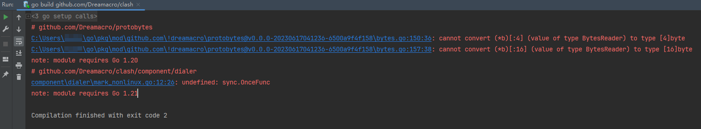

# Clash 补丁增加 SS 的 RC4 加密功能 


`Clash` 补丁, 添加 `SS`协议的`RC4`加密方法，仅供学习和研究使用

### 版本要求

Clash target version: `1.18`

go require version: `1.21`

### 已验证的环境

OS: `Windows 11 22H2`

go version: `go version go1.21.5 windows/amd64`

### 使用方法

1) copy `config`, `transport` folder to the clash source code folder root, and overwrite files
   ```
   # use patch file to overwrite source file
   cp -rv {config,transport} /clash-source-root/
   ```
2) copy ss_rc4_patch.patch file to the clash source code folder root, and run apply patch command
   ```
   # dryrun, show file changes
   git apply --stat ss_rc4_patch.patch

   # apply changes
   git apply ss_rc4_patch.patch
   ```

### 启动运行

1) run clash
   ```
   go run /clash-source-root/main.go
   ```

### 错误处理

if got this error, upgrade your GoLang version > 1.21



### 下载新版Go


https://go.dev/dl/
